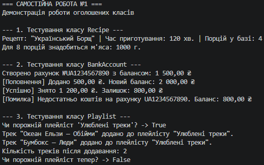

# Самостійна робота №1

**Тема:** Базовий синтаксис C# і оголошення класів.  
**Проєкт:** `IndependentWork1`

## Опис виконаної роботи

У рамках самостійної роботи було оголошено 3 класи для моделювання об'єктів реального світу:

1. **`Recipe`** — модель кулінарного рецепта.
   * *Поля:* `_title`, `_cookingTimeMinutes`, `_baseServings`.
   * *Властивості:* `Title` (read-only), `CookingTimeMinutes`.
   * *Метод:* `CalculateIngredientAmount()` — обчислює необхідну кількість інгредієнтів під задану кількість порцій.

2. **`BankAccount`** — модель банківського рахунку.
   * *Поля:* `_accountNumber`, `_balance`.
   * *Властивості:* `AccountNumber` (read-only), `Balance` (get / private set).
   * *Методи:* `Deposit()`, `Withdraw()` — реалізують поповнення та зняття коштів із перевіркою достатності балансу.

3. **`Playlist`** — модель музичного плейлісту.
   * *Поля:* `_name`, `_tracks`.
   * *Властивості:* `Name`, `TrackCount` (read-only).
   * *Методи:* `AddTrack()`, `IsEmpty()` — керують колекцією треків та перевіряють стан плейлісту.

У файлі `Program.cs` в методі `Main` наведено повну демонстрацію створення екземплярів цих класів та виконання їхніх методів із виводом результатів у консоль.

## Контрольні запитання

1. **Які мінімальні елементи повинен містити клас у цьому завданні?**
   Приватні поля, публічні властивості, конструктор та метод з бізнес-логікою.
2. **Чому поля доцільно робити приватними?**
   Для дотримання принципу інкапсуляції та захисту даних від несанкціонованої зміни.
3. **Навіщо потрібен конструктор?**
   Для початкової ініціалізації об'єкта та приведення його у коректний стан під час створення.
4. **Як у Main перевірити роботу методів?**
   Шляхом їх виклику на створених об'єктах та виводу результатів у консоль.

