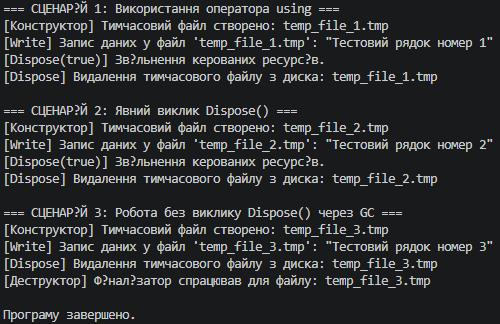

## Висновок до лабораторної роботи №3 (Варіант 8)

Під час виконання лабораторної роботи було поглиблено розуміння життєвого циклу об’єкта в середовищі .NET, а також вивчено відмінності між керованими та некерованими ресурсами. 

На прикладі класу `TemporaryFile` (варіант 8) було успішно реалізовано стандартний інтерфейс `IDisposable` та повний патерн Dispose, що включає:
* Конструктор для імітації виділення ресурсу.
* Публічний метод `Dispose()` разом із викликом `GC.SuppressFinalize(this)` для оптимізації роботи збирача сміття.
* Захищений віртуальний метод `Dispose(bool disposing)` для роздільного звільнення керованих та некерованих ресурсів.
* Деструктор (фіналізатор) із викликом `Dispose(false)` для надійного запобігання витоку ресурсів.

У ході тестування в методі `Main` було продемонстровано та порівняно три основні сценарії керування ресурсами:
1. **Використання оператора `using`**: найбезпечніший і найрекомендованіший підхід, який гарантовано викликає метод `Dispose()` відразу після виходу з блоку коду, навіть у разі виникнення винятків.
2. **Явний виклик `Dispose()`**: дає розробникові ручний контроль над часом знищення об'єкта, проте вимагає обережності, оскільки у випадку помилки до виклику метод може бути пропущений.
3. **Робота без виклику `Dispose()` через `GC`**: демонструє роботу фіналізатора, який викликається збирачем сміття. Такий підхід є неефективним та ризикованим для некерованих ресурсів, оскільки звільнення пам'яті та ресурсів відкладається на невизначений час.

