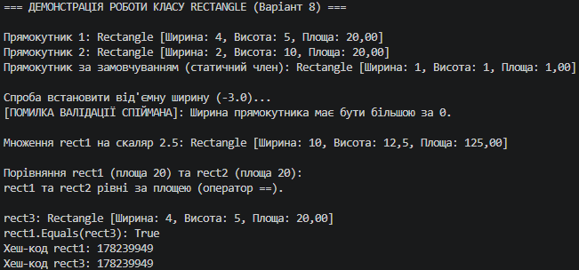

## Висновок до лабораторної роботи №4 (Варіант 8)

Під час виконання лабораторної роботи було поглиблено практичні навички проектування класів у мові C#, зокрема реалізацію інкапсуляції, роботу з властивостями, статичними членами та перевантаження операторів.

На прикладі класу `Rectangle` (варіант 8) було успішно реалізовано:
* **Приватні поля та властивості з валідацією**: додано перевірку в аксесорах `set` для властивостей `Width` і `Height`, що гарантує недопустимість нульових або від'ємних розмірів прямокутника та захищає цілісність даних об'єкта.
* **Статичний член**: властивість `DefaultRectangle`, яка дозволяє отримувати стандартний екземпляр класу безпосередньо через ім'я класу.
* **Перевантаження операторів**: перевизначено оператор `*` для множення прямокутника на скаляр із модифікацією його розмірів, а також оператори `==` і `!=` для логічного порівняння прямокутників за їхньою площею.
* **Перевизначення стандартних методів**: коректно реалізовано методи `ToString()` для зручного виводу інформації, а також `Equals()` і `GetHashCode()` відповідно до вимог перевантаження операторів порівняння.

У методі `Main` було продемонстровано коректність роботи всіх розроблених елементів, включаючи обробку винятків при спробі порушити правила валідації.

