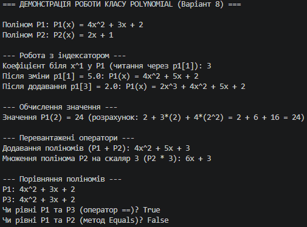

## Висновок до лабораторної роботи №5 (Варіант 8)

Під час виконання лабораторної роботи було поглиблено знання щодо створення та використання індексаторів і перевантаження операторів у мові програмування C#.

На прикладі класу `Polynomial` (варіант 8) було успішно реалізовано:
* **Приватне сховище даних та індексатор**: за допомогою масиву коефіцієнтів та індексатора `this[int degree]` забезпечено зручний доступ до коефіцієнтів полінома за їх степенем як для читання, так і для запису з можливістю динамічного розширення розмірності.
* **Перевантажені оператори**: реалізовано оператор `+` для поелементного додавання двох поліномів різних степенів та оператор `*` для масштабування полінома шляхом множення на скалярне число.
* **Перевизначення методів порівняння та ідентифікації**: коректно перевизначено методи `ToString()` для красивого математичного виводу, а також `Equals()`, `GetHashCode()`, оператори `==` і `!=` для коректного порівняння поліномів за їхніми коефіцієнтами.
* **Додатковий функціонал**: створено метод `Evaluate(double x)` для обчислення математичного значення полінома у заданій точці.

У методі `Main` було повністю продемонстровано роботу індексаторів (зміну значень і читання), а також результати виконання перевантажених операторів.

  