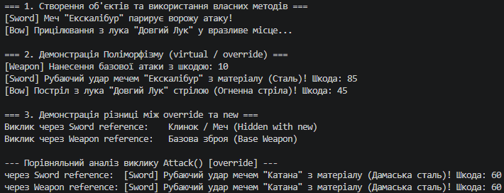

## Висновок

Під час виконання лабораторної роботи №6 було поглиблено знання про ключові принципи об'єктно-орієнтованого програмування в C#, зокрема наслідування та поліморфізм, а також практично засвоєно механізми керування поведінкою методів у класичних ієрархіях.

На прикладі ієрархії класів зброї **Weapon → Sword → Bow** (Варіант 9) було успішно реалізовано:
* **Наслідування та ініціалізацію:** Створено базовий клас `Weapon` із приватними полями, публічними властивостями та конструктором, а також похідні класи `Sword` і `Bow`, які передають дані базовому класу за допомогою ключового слова `base(...)`.
* **Поліморфізм (`virtual` / `override`):** Реалізовано віртуальний метод `Attack()` у базовому класі та його перевизначення в похідних класах. У ході тестування через масив посилань базового типу `Weapon[]` було продемонстровано пізнє (динамічне) зв'язування — викликалася саме та реалізація методу, яка відповідає фактичному типу об'єкта під час виконання.
* **Приховування членів (`new`):** У класі `Sword` за допомогою модифікатора `new` створено метод `GetWeaponType()`, що приховує однойменний метод базового класу `Weapon`.

У результаті тестування в методі `Main` було чітко продемонстровано ключову відмінність між `override` та `new`:
1. **`override` (динамічний поліморфізм):** Виклик перевизначеного методу завжди гарантує виконання коду похідного класу, незалежно від того, який тип має змінна-посилання (`Sword` чи `Weapon`).
2. **`new` (приховування / раннє зв'язування):** Виклик прихованого методу повністю залежить від типу посилання на етапі компіляції. При виклику через посилання типу `Sword` виконується новий метод похідного класу, а при виклику через посилання типу `Weapon` — оригінальний метод базового класу.

Отримані навички є фундаментальними для проектування гнучких, розширюваних та безпечних архітектур програмного забезпечення на платформі .NET.

