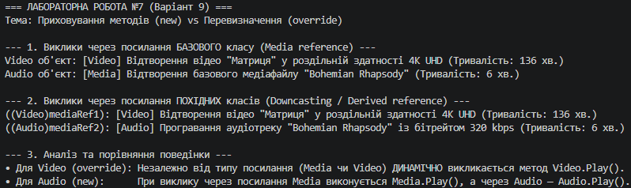

## Висновок

Під час виконання лабораторної роботи №7 було поглиблено знання про відмінності між перевизначенням методів (`override`) та їх приховуванням (`new`) у мові C#, а також практично досліджено механізми динамічного (пізнього) та статичного (раннього) зв'язування.

На прикладі ієрархії класів **Media → Video (override) / Audio (new)** (Варіант 9) було продемонстровано:
1. **Динамічний поліморфізм (`override`):** У класі `Video` перевизначено віртуальний метод `Play()`. При виклику методу через посилання базового типу `Media` виконався саме метод `Video.Play()`, оскільки C# враховує фактичний тип об'єкта під час виконання.
2. **Приховування членів (`new`):** У класі `Audio` створено новий метод `Play()` за допомогою модифікатора `new`. Це розірвало поліморфний ланцюжок: при виклику через посилання типу `Media` виконався базовий метод `Media.Play()`, і лише при явному приведенні до `Audio` або виклику через посилання `Audio` запустився прихований метод.

Результати тестування в методі `Main` підтвердили, що:
* `override` слід застосовувати, коли необхідно забезпечити єдину поліморфну поведінку для всієї ієрархії об'єктів;
* `new` слід використовувати лише для приховування успадкованого члена без зміни поліморфної поведінки базового класу.

Отримані знання дозволяють уникати помилок проектування типів даних і правильно обирати механізми перевизначення при створенні об'єктно-орієнтованих систем на платформі .NET.

