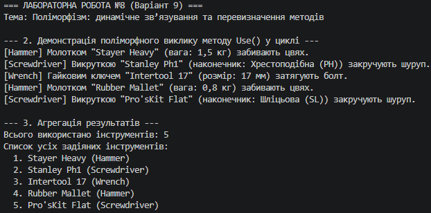

## Висновок

Під час виконання лабораторної роботи №8 було детально вивчено принцип поліморфізму та механізми динамічного (пізнього) зв'язування в мові програмування C#.

На прикладі ієрархії інструментів **Tool → Hammer, Screwdriver, Wrench** (Варіант 9) було успішно реалізовано:
1. **Ієрархію класів із віртуальними методами:** У базовому класі `Tool` визначено віртуальний метод `virtual void Use()`, який був специфічно перевизначений (`override`) у похідних класах `Hammer`, `Screwdriver` та `Wrench`.
2. **Поліморфний виклик через колекцію базового типу:** Створено колекцію `List<Tool>`, до якої додано екземпляри всіх похідних класів. У ході ітерації за допомогою циклу `foreach` продемонстровано, що завдяки динамічному зв'язуванню для кожного об'єкта автоматично викликається саме його версія методу `Use()`.
3. **Агрегацію результатів:** Проведено збір та підрахунок інформації про всі задіяні інструменти ( сформовано загальний підсумковий список виконаних дій та пораховано кількість викликів).

Застосування поліморфізму та колекцій базового типу дозволяє створювати гнучкі та розширювані програмні системи, в які легко додавати нові класи без зміни існуючої логіки обробки.

